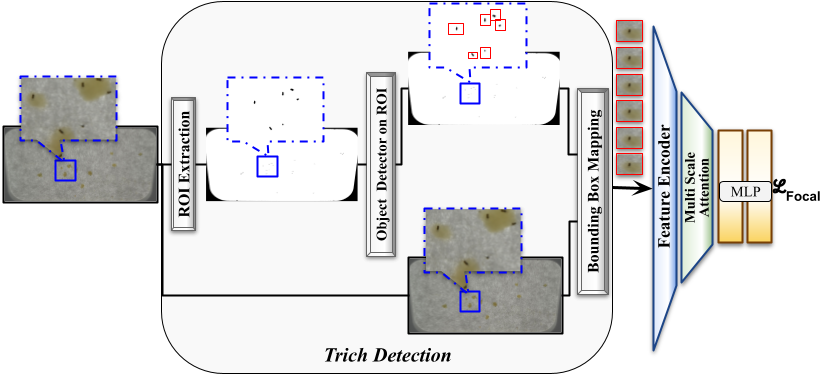

# TrichANet

This is the official implementation for **TrichANet: An Attentive Network for Trichogramma Classification**.

TrichANet is a combined detection-classification pipeline for the detection of tiny wasps from images, and subsequent classification into species.

