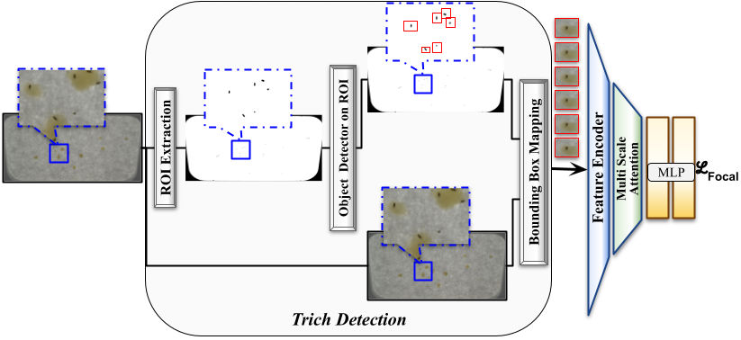

# TrichANet

This is the official implementation for **TrichANet: An Attentive Network for Trichogramma Classification**.
It has been accepted for oral presentation at The 18th International Conference on Computer Vision Theory and Applications, 2023.

TrichANet is a combined detection-classification pipeline for the detection of tiny wasps from images, and subsequent classification into species.

